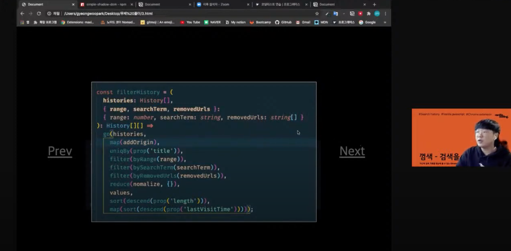

# 🔎 껌색 - 검색을 검색

### Tags
```diff
+ javascript
+ typescript
+ FP
+ shadow dom
+ open source
```

### ✅ What is Ssearch ?
자신의 검색 기록을 빠르게 찾을수 있도록 도와주는 크롬 익스텐션입니다.</br>
*2020. 11. 30 ~ 2020. 12. 18*

### ✅ Preview
</img>

<a href='https://www.youtube.com/watch?v=GZfXLyDb1JU&ab_channel=%EB%B0%95%EA%B2%BD%EC%9A%B0'>Youtube에서 보기</a>

### ✅ 발표 영상
</img>
<a href='https://youtu.be/jMw5MIxLY3o?t=2450'>유튜브 링크 [ 40분 50초 시작 ]</a>

### ✅ Download
<a href='https://chrome.google.com/webstore/detail/ssearch%EA%BB%8C%EC%83%89/kdfmgmggkkncoipjbjpbggndjmdkmjhm?utm_source=chrome-ntp-icon'>다운로드 링크</a>

### ✅ Why?
평소에 개발도구를 만들고 싶다는 생각을 하고 있었고 크롬에서 검색기록을 찾을때 불편한점이 있어서 직접 만들어보자는 생각에 만들게 되었습니다.

### ✅ Implementation

**Main Page**
- 같은 url별로 검색 기록을 카드단위로 묶습니다.
- url을 누르면 해당 url로 이동합니다.
- 카드 안에서 검색하면 해당 페이지에서 검색한 결과를 보여줍니다.
- 큰 제목을 누르면 해당 url에 대한 **Detail page**로 이동합니다.
- 검색어에 따른 필터링을 제공합니다.
- 검색 범위에 따른 필터링을 제공합니다.
- 작은 favicon을 누르면 **Preview Page**에 해당 사이트의 이미지가 저장됩니다.

**Liked Page**
- 단축키를 통해 현재 보고있는 페이지를 저잘할수 있습니다.
  **window** `ctrl + shift + s` **mac** `cmd + shift + s`
- 마우스 우클릭을 통해 조작도 가능합니다. *(좋아하는 페이지 추가 및 제거)*
- 껌색을 통해 재방문하면 Liked Page에서 해당 title의 글자가 커집니다.

**Preview Page**
- Main Page에서 저장한 해당 사이트의 preview를 이미지 형태로 제공합니다.

### ✅ Tech stack

- **Frontend**
  - **vanilla javascript**</br>
    이번 프로젝트는 자바스크립트와 더 친해지기 위해 바닐라로 작업하였습니다.
  - **typescript**</br>
    평소에 관심이 있었고 바닐라 자바스크립트로 구현하는 만큼 에디터의 도움을 받고자 사용했습니다.
  - **simple-shadow-dom**</br>
    자체 제작한 프레임 워크입니다. <a href='https://www.npmjs.com/package/simple-shadow-dom'>simple-shadow-dom</a>
- **Backend**
  - **aws-lambda**</br>
    서버에서 실행하는 로직이 단순한 함수 하나이기 때문에 serverless로 구현했습니다.

- **Libraries**
  - **webpack**</br>
    메인 페이지 html 번들링을 위해 사용되었습니다.
  - **jest**</br>
  각종 테스트를 위해 사용되었습니다.
  - **lodash**

  - **ramda**</br>
    함수형 프로그래밍 도입을 위해 처음에는 자체 제작 함수를 사용하다 확장성을 위해 ramda 라이브러리를 사용하게 되었습니다.

  - **sanitize-html**</br>
    사용자의 검색 기록이 동적으로 들어오고, 해당 기록이 html template 으로 만들어 지기때문에 값을 정제하기 위해 사용되었습니다.

  - **date-fns**</br>
    각종 시간 관련 유틸함수에 사용되었습니다.

  - **eslint**</br>
    code style을 통일하기 위해 사용되었습니다.

  - **puppeteer**</br>
    웹사이트 미리보기를 구현하기위해 사용되었습니다.

### ✅ Brain storm
  - **<a href='https://www.figma.com/file/znKfI3AvJBmMw48OO5L2ko/Untitled?node-id=0%3A1'>mockup schema</a>**</br>
  figma를 아용한 목업 디자인
  - **<a href='https://www.notion.so/22415a9779544ecd9344ef1715e77860?v=3881a55678894b1c8b2ed0dcf7b3b77a'>notion</a>**</br>
  전체적인 태스크 기록

### ✅ Issues
  - **<a href='https://www.notion.so/22415a9779544ecd9344ef1715e77860?v=3881a55678894b1c8b2ed0dcf7b3b77a&p=a02cfc06045c416889c8b855709fe879'>Contribute Open Source [DefinitelyTyped]</a>**</br>
    chrom extention을 만들면서 types/chrome에 누락된 타입을 수정후 기여
  - **<a href='https://www.notion.so/22415a9779544ecd9344ef1715e77860?v=3881a55678894b1c8b2ed0dcf7b3b77a&p=c65c5492587a41dca36ff0ef6f375769'>Functional Programming</a>**</br>
  typescript + functional programming?
  - **<a href='https://www.notion.so/22415a9779544ecd9344ef1715e77860?v=3881a55678894b1c8b2ed0dcf7b3b77a&p=ebda8b82b40e45beb66c23cf96d00027'>Shadow Dom</a>**</br>
  What is shadow dom?
  - **<a href='https://www.notion.so/22415a9779544ecd9344ef1715e77860?v=3881a55678894b1c8b2ed0dcf7b3b77a&p=79ce0d4a6b1441c091f987384e07a8de'>Css In Js</a>**
  - **<a href='https://www.notion.so/22415a9779544ecd9344ef1715e77860?v=3881a55678894b1c8b2ed0dcf7b3b77a&p=e4f3f5f113a84b9c860e7c69dc0c86e1'>Typescript</a>**</br>
  any? any? any?
  - **<a href='https://www.notion.so/22415a9779544ecd9344ef1715e77860?v=3881a55678894b1c8b2ed0dcf7b3b77a&p=3582a613d54442738d6421b3e7bcd46f'>Webpack Config</a>**</br>
  webpack version issue
  - **<a href='https://www.notion.so/22415a9779544ecd9344ef1715e77860?v=3881a55678894b1c8b2ed0dcf7b3b77a&p=a7cd8c899f3041cca2ad10d667565cb6'>Hooks Closure</a>**
  - **<a href='https://www.notion.so/22415a9779544ecd9344ef1715e77860?v=3881a55678894b1c8b2ed0dcf7b3b77a&p=85dfcabdafd34c27b9409793cd97ce96'>Aws Lambda</a>**
  - **<a href='https://www.notion.so/22415a9779544ecd9344ef1715e77860?v=3881a55678894b1c8b2ed0dcf7b3b77a&p=3f1f5ba117fd4c8bbcdfe597cd4a4e5a'>Sanitize Html</a>**

### ✅ Minor subject

- **고정관념 탈피**</br>
  react와 express를 배우면서 점점 정해진 코드대로만 쓰려고 하고 안전한 컨벤션만 따라가는 경향이 보였었다. 그런게 나쁜건 아니지만 점점 자연스러운 코딩이 아닌 틀에 맞춰서 결과 찍어내는느낌이 들었다. 그래서 이번 프로젝트에서는 바닐라 자바스크립트를 시도했던것이다. 몇달 배우지도 않았는데 사고방식이 완전히 리액트에 갇혀있어서 해당 틀을 깨는데 시간이 많이 걸렸다. 프로젝트중 여러가지 프레임워크를 접했던게 고정관념을 깨는데 많은 도움을 줬고, `backbone, riot js, jquery, svelte, etc...`해당 프레임 워크들을 보면서 다시 자바스크립트는 다양하고 정해진 정답은 없다는걸 느꼈다.
- **OOP**</br>
  객체지향은 프로그래밍은 정말 알다가도 모르겟는 지향이다. 이번 프로젝트에선 `캡슐화`, `추상화`, `다형성`, 을 계속 생각하면서 코딩을 했다. 여러가지 디자인 패턴은 여전히 공부가 필요하다.
- **FP**</br>
  함수형 프로그래밍은 여러가지 순수한 함수들로 이루어져있어 테스트가 용이하고 코드를 읽기 쉽고 믿을수 있다는게 장점인거같다. 이번 프로젝트에서 많은 부분을 함수형으로 사고해서 코딩을 했다.
- **Easy test**</br>
  FP의 연장선이기도 한데 그동안 공부하면서 내 코드를 테스트하는게 참 쉽지가 않았다. 테스트하기 어렵다는건 그만큼 함수가 하는 역할이 많고 로직분리가 잘 안되어있다는 뜻이기도 한데, 이번 프로젝트에선 FP를 적극 도입해서 그런지 테스트가 굉장히 수월했다. 프로젝트에선 여러가지 유틸리티 함수에만 FP가 도입됐는데 다른 돔 조작이나 많은 부분에 다양하게 도입하기 위해 추가적인 공부를 하고싶다.

### ✅ End...?
개발 공부는 끝이 없다. 한가지 프로젝트가 끝나면 또 새롭게 배울것들이 늘어난다. 이번 프로젝트를 진행하면서 모자랐던 부분은 다시 공부하면서 또 다른 프로젝트를 진행하고 싶다.

### ✅ Plus
- **<a href='https://github.com/Youout2020/youout-frontend'>first project</a>** github page
- **<a href='https://github.com/geewoo94/simple-shadow-dom'>simple-shadow-dom </a>** github page
